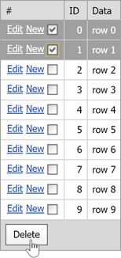

<!-- default badges list -->

[](https://supportcenter.devexpress.com/ticket/details/E3076)
[](https://docs.devexpress.com/GeneralInformation/403183)
<!-- default badges end -->
# Grid View for ASP.NET Web Forms - How to Delete Selected Rows in a Grid
<!-- run online -->
**[[Run Online]](https://codecentral.devexpress.com/e3076/)**
<!-- run online end -->


The example shows how to delete the selected rows of an [ASPxGridView](https://docs.devexpress.com/AspNet/DevExpress.Web.ASPxGridView) that is bound to an in-memory DataSource.



Use the client-side [PerformCallback](https://docs.devexpress.com/AspNet/js-ASPxClientGridView.PerformCallback(args)?p=netframework) method to send custom callbacks to the server when a user clicks the **Delete** button.

```aspx
function OnClickButtonDel(s, e) {
    grid.PerformCallback('Delete');
}
...
<dx:ASPxButton ID="buttonDel" AutoPostBack="false" 
               runat="server" Text="Delete">
    <ClientSideEvents Click="OnClickButtonDel"/>
</dx:ASPxButton>
```

On the server, the `PerformCallback` method raises the [CustomCallback](https://docs.devexpress.com/AspNet/DevExpress.Web.ASPxGridView.CustomCallback?p=netframework) event. 

In the `CustomCallback` event handler, call the [GetSelectedFieldValues](https://docs.devexpress.com/AspNet/DevExpress.Web.ASPxGridBase.GetSelectedFieldValues(System.String--)?p=netframework) method to obtain the selected rows. Then, call the [Remove](https://docs.microsoft.com/en-us/dotnet/api/system.data.datarowcollection.remove?view=net-6.0) method for each selected row.

```cs
protected void gridView_CustomCallback(object sender, ASPxGridViewCustomCallbackEventArgs e) {
    if(e.Parameters == "Delete") {
        table = GetTable();
        List<Object> selectItems = grid.GetSelectedFieldValues("ID");
        foreach(object selectItemId in selectItems) {
            table.Rows.Remove(table.Rows.Find(selectItemId));
        }
        grid.DataBind();
        grid.Selection.UnselectAll();
    }
}
```

## Files to Look At

* [Default.aspx](./CS/WebSite/Default.aspx) (VB: [Default.aspx](./VB/WebSite/Default.aspx))
* [Default.aspx.cs](./CS/WebSite/Default.aspx.cs#L45-L55) (VB: [Default.aspx.vb](./VB/WebSite/Default.aspx.vb#L60-L70))

## Documentation

* [ASPxGridView](https://docs.devexpress.com/AspNet/DevExpress.Web.ASPxGridView)
* [Grid View - Add and Edit Records](https://docs.devexpress.com/AspNet/401098/components/grid-view/concepts/edit-data/add-and-edit-records)
* [Grid View - Delete Records](https://docs.devexpress.com/AspNet/401080/components/grid-view/concepts/edit-data/delete-records)
* [Grid View - Examples](https://docs.devexpress.com/AspNet/3768/components/grid-view/examples)

## More Examples

* [How to Move Selected Rows From the ASPxGridView Into Another ASPxGridView](https://github.com/DevExpress-Examples/how-to-move-selected-rows-from-the-aspxgridview-into-another-aspxgridview-e2636)
* [How to Edit an In-Memory Dataset](https://github.com/DevExpress-Examples/aspxgridview-editing-an-in-memory-dataset-e257)
